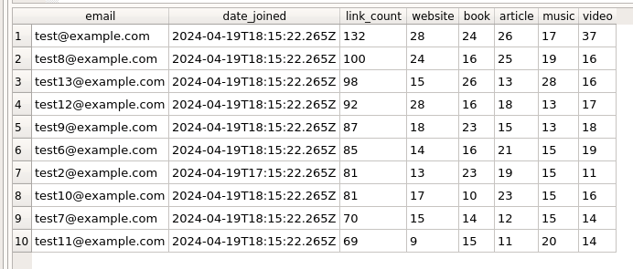

# LinkDrop

### This is project for test assignment of junior python developer position

## **1. API** 

### ___Features___

1. __User__:
    - create user (email + password)
    - login/logout
    - change password
    - authentication

2. __Collection__
    - create collection
    - edit collection
    - delete collection
    - view collection/collections

3. __Link__
    - create link
    - edit link
    - delete link
    - view link/links/links by collection

4. Documentation on Swagger. Check on http://127.0.0.1:8000/api/docs/

## Requirements

 - Python (3.12)
 - Django (5.0.4)
 - psycopg (3.1.8)
 - djangorestframework (3.15.1)
 - beautifulsoup4 (4.12.3)
 - requests (2.31.0)
 - drf-spectacular (0.27.2)

## Installation

```
git clone https://github.com/BerlinerBY/LinkDrop
cd LinkDrop/
sudo docker compose build
sudo docker compose up -d
```

## **2. SQL**  

I used custom-script for generate a data for db (`SQL/insert_db_data.py`). There is a Database with data near script. 

```SQL
SELECT 
	c.email, 
	c.date_joined, 
	COUNT(ls.id) AS link_count, 
	SUM(CASE WHEN ls.type_of_link = 'website' THEN 1 ELSE 0 END) AS website,
	SUM(CASE WHEN ls.type_of_link = 'book' THEN 1 ELSE 0 END) AS book,
	SUM(CASE WHEN ls.type_of_link = 'article' THEN 1 ELSE 0 END) AS article,
	SUM(CASE WHEN ls.type_of_link = 'music' THEN 1 ELSE 0 END) AS music,
	SUM(CASE WHEN ls.type_of_link = 'video' THEN 1 ELSE 0 END) AS video
FROM accounts_customuser c
LEFT JOIN link_storage_link ls ON c.id = ls.created_by_id
GROUP BY c.email, c.date_joined
ORDER BY link_count DESC, c.date_joined ASC
LIMIT 10;
```

### Result



### P.S.

There is some mistakes:
 - Names of collections should be unique for all users not each. _Ex. user1 have collection_N1, user2 can't have collection with the same name_.
 - Documentation can be better.
 - ...